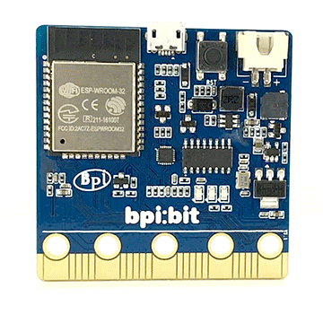

# mircopython - Led
#### 📖 [中文文档](https://github.com/aJantes/rolling_text/blob/master/readme.md)

> Hardware introduction：

- [BPI:bit(ESP32)](https://github.com/aJantes/introduce-bpi-bit/blob/master/readme.md)   
- [LED(WS2812B)](https://github.com/BPI-STEAM/BPI-BIT/blob/master/doc/WS2812B.pdf)

# LED Matrix Display
LED Matrix Hardware correlation function [display Modular](https://github.com/BPI-STEAM/MicroPython-Samples/blob/master/10.microbit/display.py). Before calling related functions, you need to import the corresponding libraries.
    
## **Display scrolling text**

The LED panel of ** bpi: bit ** uses programmable RGB lamp (ws2812b), which can theoretically display 255 * 255 * 255 * 255 colors, or 16 million colors, by programming.
## Main functions 

- `display.scroll(val, color=Red, delay=150)`：

For example: `display.scroll("Hello World!",color=Yellow,delay=200)` Scroll over the LED matrix to display the Yellow "Hello World!" string with a scrolling interval of 200 ms.

## **Panel Display Image**

The display of images is due to the different states of each LED lamp on and off, color and brightness on the LED matrix. As long as the state of different LED lights is controlled, the desired image can be formed. The image is made up of a list, in which the values of 1 (bright) or 0 (dark) are assigned according to the order of LED lights, respectively, to display the image.  

## Main functions
- `display.show(images, loop, delay)`:

For example: `display.show(Image.ALL_CLOCKS, loop=True, delay=100)`  In the LED matrix, the clock is displayed by the brightness and extinction of the led. The clock is played back and forth with a change interval of 100 ms.

---

## **Example**
1. [show_text.py](https://github.com/aJantes/rolling_text/example/blob/master/show_text.py)   -Display simple text
2. [display_yellow_text.py](https://github.com/aJantes/rolling_text/example/blob/master/display_yellow_text.py)   -Show Simple Text Show Yellow Text
3. [display_color_text.py](https://github.com/aJantes/rolling_text/example/blob/master/display_color_text.py)  -Display multicolor text
4. [display_custom_color.py](https://github.com/aJantes/rolling_text/example/blob/master/display_custom_color.py)  -Display multicolor text to display custom color text
5. [show_image.py](https://github.com/aJantes/rolling_text/example/blob/master/show_image.py)  -Display built-in images
6. [show_my_image.py](https://github.com/aJantes/rolling_text/example/blob/master/show_my_image.py)  -Display custom images
7. [show_clock.py](https://github.com/aJantes/rolling_text/example/blob/master/show_clock.py)  -Display built-in animation
8. [show_animation.py](https://github.com/aJantes/rolling_text/example/blob/master/show_animation.py)  -Display custom animation

