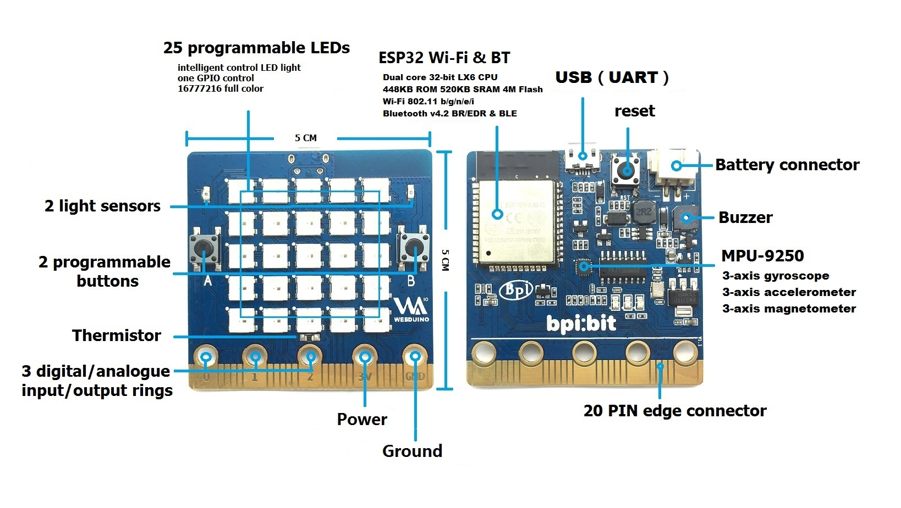

# Document

提示：第一次阅读仅需一分钟快速浏览该部分，以后学习过程中需要用到什么的时候还会再次参考此处提供的硬件资料，有关硬件的原理图或DataSheet更多可以到[BPI-BIT](https://github.com/BPI-STEAM/BPI-BIT)获取。

## 认识 BPI:bit

本产品采用 ESP-WROOM-32 作为核心进行设计，支持蓝牙、BLE等多种通信方式。

- ESP-WROOM-32
- 448KB ROM
- 520KB RAM
- Wi-Fi & BLE

正面具有 25 颗（ 5 * 5 ）可编程 LED 灯，单GPIO控制，单颗 16777216 色显示；并且正面还具有 2 个用户可编程按键。

### 1. 外设一览

### 2. 引脚定义

| Pin Name | Analog Function1 | Analog Function2 | Function1 | Function2 | Power     |
| -------- | ---------------- | ---------------- | --------- | --------- | --------- |
| P3       | ADC2\_CH4        |                  | GPIO13    |           |           |
| P0       | ADC2\_CH8        | DAC\_1           | GPIO25    |           |           |
| P4       | ADC2\_CH3        |                  | GPIO15    |           |           |
| P5       | ADC1\_CH7        |                  | GPIO35    |           |           |
| P6       | ADC2\_CH5        |                  | GPIO12    |           |           |
| P7       | ADC2\_CH6        |                  | GPIO14    |           |           |
| P1       | ADC1\_CH4        |                  | GPIO32    |           |           |
| P8       |                  |                  | GPIO16    |           |           |
| P9       |                  |                  | GPIO17    |           |           |
| P10      | ADC2\_CH9        | DAC\_2           | GPIO26    |           |           |
| P11      | ADC2\_CH7        |                  | GPIO27    |           |           |
| P12      | ADC2\_CH2        |                  | GPIO02    |           |           |
| P2       | ADC1\_CH5        |                  | GPIO33    |           |           |
| P13      |                  |                  | GPIO18    | SPI\_SCK  |           |
| P14      |                  |                  | GPIO19    | SPI\_MISO |           |
| P15      |                  |                  | GPIO23    | SPI\_MOSI |           |
| P16      |                  |                  | GPIO05    | SPI\_SS   |           |
| 3V3      |                  |                  |           |           | POWER:3V3 |
| 3V3      |                  |                  |           |           | POWER:3V3 |
| 3V3      |                  |                  |           |           | POWER:3V3 |
| P19      |                  |                  | GPIO22    | I2C\_SCL  |           |
| P20      |                  |                  | GPIO21    | I2C\_SDA  |           |
| GND      |                  |                  |           |           | GROUND    |
| GND      |                  |                  |           |           | GROUND    |
| GND      |                  |                  |           |           | GROUND    |

### 3. LED阵列编号

BPI:bit 板按照 5 * 5 排列方式焊接了25颗(编号0~24)1600万色全彩LED(WS2812)，所有的LED的控制仅使用一个引脚(GPIO4)即可完成全部控制，同时BPI:bit板还预留LED电源控制引脚(GPIO2)，可以通过拉低GPIO2的点位来关闭全部LED的电源。

LED序号排布方式如下（5 * 5）：

| ↖  |  ↑  |  ↑  |  ↑  |  ↗ |
|-----|-----|-----|-----|-----|
| 20  | 15  | 10  | 5   | 0   |
| 21  | 16  | 11  | 6   | 1   |
| 22  | 17  | 12  | 7   | 2   |
| 23  | 18  | 13  | 8   | 3   |
| 24  | 19  | 14  | 9   | 4   |
| ↙  |  ↓  |  ↓  |  ↓  |  ↘ |
| P0  | P1  | P2  | 3V   | GND   |

（将板子正面朝向自己，并结合底盘金手指可知位置）

### 3. 板上的其他定义

| Interface          | IO      | Mode                                |
|--------------------|---------|-------------------------------------|
| Light Sensor(L)    | GPIO 36 | Analog Input                        |
| Light Sensor(R)    | GPIO 39 | Analog Input                        |
| Temperature Sensor | GPIO 34 | Analog Input                        |
| Buzzer             | GPIO 25 | PWM(Digital Output) / Analog Output |
| RGB_LED            | GPIO 4  | Digital Output                      |
| MPU9250_SCL        | GPIO 22 | Digital Output                      |
| MPU9250_SDA        | GPIO 21 | Digital Output                      |
| MPU9250_INT        | GPIO 16 | Digital Input                       |
| R_LED(SPI_SCK)     | GPIO 18 | Digital Output                      |

