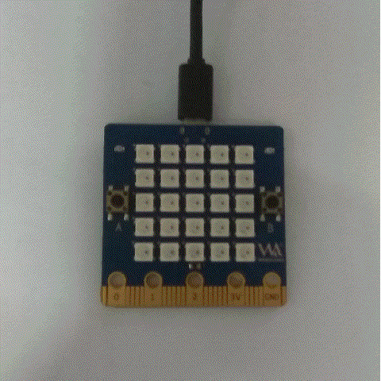
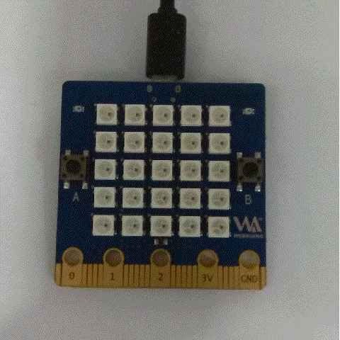
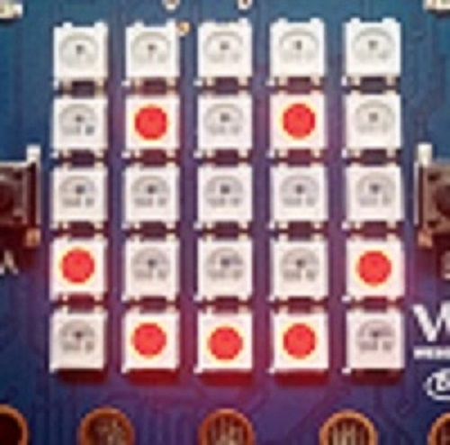
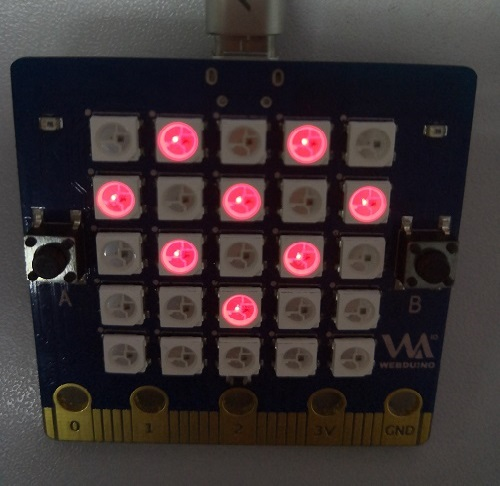
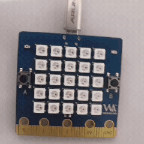

# Document
- 前提准备：[第一次使用必看](https://github.com/aJantes/Initialize-the-board/blob/master/readme.md)
- 硬件介绍：[BPI:bit(ESP32)](https://github.com/aJantes/introduce-bpi-bit/blob/master/readme.md)
- 编程工具：[pycharm](https://github.com/aJantes/use-pycharm/blob/master/readme.md)
## LED矩阵上显示文字
在BPI:bit(ESP32)显示想要的文字


### 简单的显示文本

- [show_text.py](https://github.com/aJantes/rolling_text/blob/master/show_text.py)


### 字符颜色改变
 相比于microbit，bpibit的led面板采用的是可编程的RGB灯(ws2812b)
 [点击查看WS2812B更详细的信息](https://github.com/BPI-STEAM/BPI-BIT/blob/master/doc/WS2812B.pdf)
 

这种RGB灯通过编程理论上可以显示255 *255 *255种颜色，也就是1600万种颜色


想要改变字体的颜色是很简单的，在我们的固件中预置了8种颜色

```Python
black = [0, 0, 0]   
Red = [2, 0, 0]
Orange = [2, 1, 0]
Yellow = [2, 2, 0]
Green = [0, 2, 0]
Blue = [0, 0, 2]
Indigo = [0, 2, 2]
Purple = [2, 0, 2]
```
分别是黑（灯熄灭，注意大小写）、红、橙、黄、绿、蓝、靛、紫。有了这几种基本的颜色就可以来修改我们的字体颜色


### 显示黄色字体
- [display_yellow_text.py](https://github.com/aJantes/rolling_text/blob/master/display_yellow_text.py)


### 显示多色字体
- [display_color_text.py](https://github.com/aJantes/rolling_text/blob/master/display_color_text.py)



### 自定义颜色
  
- [display_custom_color.py](https://github.com/aJantes/rolling_text/blob/master/display_custom_color.py)

如果想要了解更多RGB颜色， [请点击查看RGB颜色查询对照表](http://tool.oschina.net/commons?type=3)





### 面板显示图像


- [show_image.py](https://github.com/aJantes/rolling_text/blob/master/show_image.py)



### 内置的图片列表如下

- Image.HEART
- Image.HEART_SMALL
- Image.HAPPY
- Image.SMILE
- Image.SAD
- Image.CONFUSED
- Image.ANGRY
- Image.ASLEEP
- Image.SURPRISED
- Image.SILLY
- Image.FABULOUS
- Image.MEH
- Image.YES
- Image.NO
- Image.CLOCK12, Image.CLOCK11, Image.CLOCK10, Image.CLOCK9, Image.CLOCK8, Image.CLOCK7, Image.CLOCK6, Image.CLOCK5, Image.CLOCK4, Image.CLOCK3, Image.CLOCK2, Image.CLOCK1
- Image.ARROW_N, Image.ARROW_NE, Image.ARROW_E, Image.ARROW_SE, Image.ARROW_S, Image.ARROW_SW, Image.ARROW_W, Image.ARROW_NW
- Image.TRIANGLE
- Image.TRIANGLE_LEFT
- Image.CHESSBOARD
- Image.DIAMOND
- Image.DIAMOND_SMALL
- Image.SQUARE
- Image.SQUARE_SMALL
- Image.RABBIT
- Image.COW
- Image.MUSIC_CROTCHET
- Image.MUSIC_QUAVER
- Image.MUSIC_QUAVERS
- Image.PITCHFORK
- Image.XMAS
- Image.PACMAN
- Image.TARGET
- Image.TSHIRT
- Image.ROLLERSKATE
- Image.DUCK
- Image.HOUSE
- Image.TORTOISE
- Image.BUTTERFLY
- Image.STICKFIGURE
- Image.GHOST
- Image.SWORD
- Image.GIRAFFE
- Image.SKULL
- Image.UMBRELLA
- Image.SNAKE

### 创造自己的图片

在每一个 LED 在物理显示上可以被设置为一个值，类似于高低电平，比如某个像素点被设置成 0 ，那么它的亮度就是 0 .然而如果它被设置成 1，那么它就是指灯的亮度为 1 。利用led的亮与灭，很容易的创造一个想要的新图片
- [show_my_image.py](https://github.com/aJantes/rolling_text/blob/master/show_my_image.py)




### 如何制作一个简单的动画

- [show_clock.py](https://github.com/aJantes/rolling_text/blob/master/show_clock.py)


### 创造自己的动画
- [show_animation.py](https://github.com/aJantes/rolling_text/blob/master/show_animation.py)




#### 下面有几个注意点

1. 每个颜色的亮度都有0-255总共256个数值可以选择，所以最小就是[0 , 0 , 0],最大就是[255 ,255 , 255]
2. 亮度一般不要调得太大，亮度太亮容易晃眼睛
3. 如果要使用内置的颜色就要导入 display 模块，就可以使用了内置的颜色Red，所以在一开始就通过 from display import *  导入display模块

