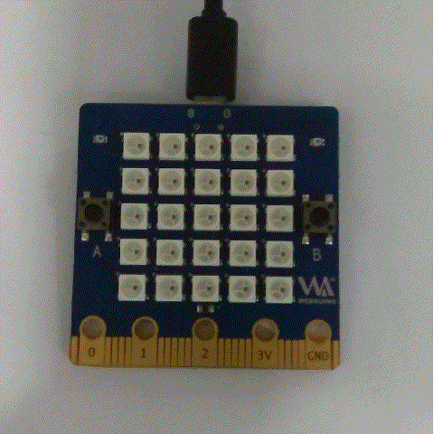

# Document


## LED矩阵上显示文字
首先要学习的是在板子显示想要的文字，例如"Hello,World!"


### 示例代码
```python
from microbit import *
display.scroll("Hello, World!")
```
- `from microbit import *` 是告诉MicroPython 获取所需要的组件或者模块，如果你之前接触过c语言，可以按照库来理解，所有模块是已经存在的代码库，这些库是从microbit中导入的。
- `display.scroll("Hello, World!")` 告诉microPython使用display命令去滚动string的“Hello，World！”


## 字符颜色改变
- 相比于microbit，bpibit的led面板采用的是可编程的RGB灯(ws2812b)
 [点击查看WS2812B更详细的信息](https://github.com/BPI-STEAM/BPI-BIT/blob/master/doc/WS2812B.pdf)
 

- 这种RGB灯通过编程理论上可以显示255 *255 *255种颜色，也就是1600万种颜色


- 想要改变字体的颜色是很简单的，在我们的固件中预置了8种颜色

```Python
black = [0, 0, 0]   
Red = [2, 0, 0]
Orange = [2, 1, 0]
Yellow = [2, 2, 0]
Green = [0, 2, 0]
Blue = [0, 0, 2]
Indigo = [0, 2, 2]
Purple = [2, 0, 2]
```
分别是黑（灯熄灭，注意大小写）、红、橙、黄、绿、蓝、靛、紫。有了这几种基本的颜色就可以来修改我们的字体颜色

#### 示例代码
##### 显示黄色字体

``` python

from display import*
display=Display()
display.scroll("Hello, World!",Yellow)

```


- 板子默认显示的颜色是红色，只要在字符串(也就是上面的"Hello, World!")后面添加其他颜色，就可以修改显示的字符的颜色。从上面那个图可以看到我们字符的颜色已经变为黄色

##### 显示多色字体
```python
from display import*
display=Display()
color=[Red,Orange,Yellow,Green,Blue,Indigo,Purple]
display.scroll("ROYGBIP",color)
```


- 我们新建了一个列表color，里面按顺序存放着每个字符所需要的颜色，然后在scroll函数的后面把color添加进去，这样每个字符的颜色就不一样
#### 自定义颜色
  
- 前面我们用列表的方式来保存颜色的信息

```python
Red = [2, 0, 0]
```


这里我们同样也可以按照这样的方式来定义我们的颜色

***tip***： 如果想要了解更多RGB颜色， [请点击查看RGB颜色查询对照表](http://tool.oschina.net/commons?type=3)
- 下面我们来定义一个mycolor=[1 , 2 , 3]看看显示的效果

```python
from display import*
display=Display()
mycolor=[1,2,3]
display.scroll("hello",color=mycolor)
```




## 面板显示图像


- 在开始项目之前，你需知道 Python 已经了内置的许多图片，如果你想要显示一个笑脸的话，那你只需要运行以下列代码

```python
from microbit import *
display.show(Image.HAPPY)
```

- 第二行就是指通过了 display 模块来显示内置的 Image 图片，展示的这个笑脸图案其实只是 Image 的一部分，而它的名字叫做 Happy，并且要通过 show 并将它放置在括弧内，以使得它显示出来，所以写成 `display.show(Image.HAPPY)`


#### 内置的图片列表如下

- Image.HEART
- Image.HEART_SMALL
- Image.HAPPY
- Image.SMILE
- Image.SAD
- Image.CONFUSED
- Image.ANGRY
- Image.ASLEEP
- Image.SURPRISED
- Image.SILLY
- Image.FABULOUS
- Image.MEH
- Image.YES
- Image.NO
- Image.CLOCK12, Image.CLOCK11, Image.CLOCK10, Image.CLOCK9, Image.CLOCK8, Image.CLOCK7, Image.CLOCK6, Image.CLOCK5, Image.CLOCK4, Image.CLOCK3, Image.CLOCK2, Image.CLOCK1
- Image.ARROW_N, Image.ARROW_NE, Image.ARROW_E, Image.ARROW_SE, Image.ARROW_S, Image.ARROW_SW, Image.ARROW_W, Image.ARROW_NW
- Image.TRIANGLE
- Image.TRIANGLE_LEFT
- Image.CHESSBOARD
- Image.DIAMOND
- Image.DIAMOND_SMALL
- Image.SQUARE
- Image.SQUARE_SMALL
- Image.RABBIT
- Image.COW
- Image.MUSIC_CROTCHET
- Image.MUSIC_QUAVER
- Image.MUSIC_QUAVERS
- Image.PITCHFORK
- Image.XMAS
- Image.PACMAN
- Image.TARGET
- Image.TSHIRT
- Image.ROLLERSKATE
- Image.DUCK
- Image.HOUSE
- Image.TORTOISE
- Image.BUTTERFLY
- Image.STICKFIGURE
- Image.GHOST
- Image.SWORD
- Image.GIRAFFE
- Image.SKULL
- Image.UMBRELLA
- Image.SNAKE

### 创造自己的图片

- 在每一个 LED 在物理显示上可以被设置为一个值，类似于高低电平，比如某个像素点被设置成 0 ，那么它的亮度就是 0 .然而如果它被设置成 1，那么它就是指灯的亮度为 1 。利用led的亮与灭，很容易的创造一个想要的新图片

```python
from microbit import *

love = Image("01010:"
             "10101:"
             "01010:"
             "00100:"
             "00000")

display.show(love)
```


- 如果你能保证每一行不出错，也可以这样写

```python
love = Image("01010:10101:01010:00100:00000")
```

### 如何制作一个简单的动画

- 和单张 image 一样，使用 `display.show` 让它在设备上显示，然后告诉 Python 使用 Image.ALL_CLOCKS 这个列表，它便会按顺序展示这个 list 所有元素
- 通过 `loop=True`，使Python 保持循环状态
- `delay=100`设置这个动画切换图片的时间

```python
from microbit import *
display.show(Image.ALL_CLOCKS, loop=True, delay=100)
```


## 创造自己的动画
- 结合上面所学的知识，做一个爱心下沉到底部的动画，并变颜色
```python
from microbit import *

Red=(2, 0, 0)
love1 = Image("01010:"
             "10101:"
             "01010:"
             "00100:"
             "00000")

love2 = Image("00000:"
             "01010:"
             "10101:"
             "01010:"
             "00100")

love3 = Image("00000:"
             "00000:"
             "01010:"
             "10101:"
             "01010")

love4 = Image("00000:"
             "00000:"
             "00000:"
             "01010:"
             "10101")

love5 = Image("00000:"
              "00000:"
              "00000:"
              "00000:"
              "01010")

love6 = Image("00000:"
              "00000:"
              "00000:"
              "00000:"
              "00000")

all_loves = [love1, love2, love3, love4, love5, love6]
display.show(all_loves, delay=500, loop=True,color=Red)
```


- `Red=(2, 0, 0)`定义颜色
- 使用`Image()`创作出自己想要显示的图片，再通过list列表存储全部的图片，只要在`display.show()`导入列表便能显示出由一张张图片构成的动画


##### 下面有几个注意点

- 每个颜色的亮度都有0-255总共256个数值可以选择，所以最小就是[0 , 0 , 0],最大就是[255 ,255 , 255]
- 亮度一般不要调得太大，亮度太亮容易晃眼睛
- 如果要使用内置的颜色就要导入 display 模块，就可以使用了内置的颜色Red，所以在一开始就通过 from display import *  导入display模块

